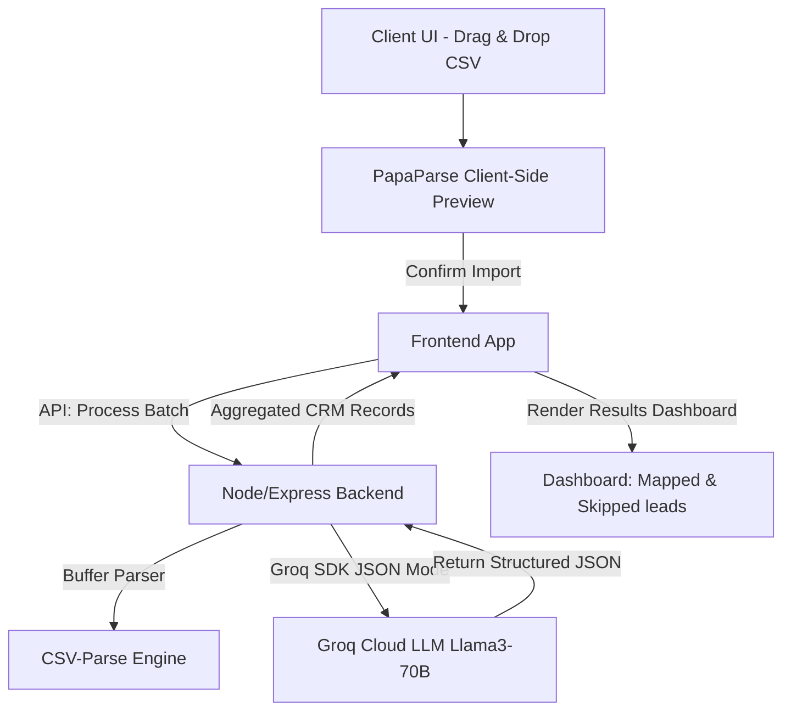

# AI-Powered CRM Lead Ingestion Engine

An intelligent, fast, and responsive web application designed for **GrowEasy** to map, clean, and import lead details from any unstructured CSV file (Facebook Lead exports, Google Ads exports, custom Excel sheets, agency formats) into a structured CRM format. 

Powered by **Next.js**, **Express**, and **Groq Cloud LLM** (utilizing `llama3-70b-8192` for high accuracy).

---

## ⚡ Key Features

* **AI-Powered Intelligent Mapping**: Auto-detects and converts columns like `Client Name` or `Org` into standardized CRM schema fields like `name` and `company`.
* **Sub-Second Processing Latency**: Leverages **Groq Cloud LLM** for ultra-fast, high-accuracy inference.
* **Resilient Batch Import**: Splits records into chunks, handling API rate limits gracefully.
* **Fault-Tolerant Retry Mechanism**: Includes automated retry capability with exponential backoff on failed batches.
* **Responsive Client-Side Preview**: Displays sticky-header preview tables with zero initial lag before running AI processing.
* **Double-Layer Skip Validation**: Programmatically and semantically filters invalid records (missing both email and phone numbers) to ensure data cleanups.
* **Premium Dark Theme**: Sleek, glassmorphic layout, glowing elements, and responsive custom scroll tables.
* **Docker Support**: Containerized services with Docker Compose for easy orchestration.

---

## 🏗️ Architecture



---

## 🛠️ Tech Stack

* **Frontend**: Next.js 15 (App Router, Client-side React, Custom CSS Modules/Globals)
* **Backend**: Node.js & Express (Stateless, multer for upload buffers, csv-parse)
* **AI Engine**: Groq Cloud SDK (`llama3-70b-8192`)
* **Deployment & Containerization**: Docker, Docker Compose

---

## 🚀 Setup & Running Locally

### Prerequisites
* [Node.js](https://nodejs.org/) (v18 or higher)
* A [Groq Cloud API Key](https://console.groq.com/)

### 1. Clone & Initialize Environment
Set up your environment keys in the backend directory.
```bash
# Go to backend
cd backend
# Copy env example
cp .env.example .env
```
Edit `backend/.env` and replace `your_groq_api_key_here` with your actual Groq API Key:
```env
PORT=5000
GROQ_API_KEY=gsk_...
```

---

### 2. Running via Docker Compose (Recommended)
You can build and spin up the entire monorepo stack with a single command:
```bash
docker-compose up --build
```
* **Frontend Dashboard**: `http://localhost:3000`
* **Backend API**: `http://localhost:5000`

---

### 3. Running Manually

#### Run Backend API
```bash
cd backend
npm install
npm run dev
```
* Backend runs on `http://localhost:5000`

#### Run Frontend Application
```bash
cd ../frontend
npm install
npm run dev
```
* Frontend runs on `http://localhost:3000`

---

## 🧪 Testing and Verification

A comprehensive local test suite is available in the backend to verify the parser and AI mapper.

```bash
cd backend
npm test
```

### Mock Datasets Included
We've included sample datasets in `test-data/` to test mapping quality:
* `facebook_leads.csv`: Standard export structure.
* `messy_leads.csv`: Alternative headers (e.g. `Client Name`, `Contact Emails`), multiple email/phone strings to test concatenation, and note fields.
* `invalid_leads.csv`: Rows missing contact fields to test skip logic.

---

## 📝 GrowEasy CRM Schema Mapped Fields

| Standard CRM Field | Type | Description |
|---|---|---|
| `created_at` | String | Formatted date convertible via JS `new Date()` |
| `name` | String | Extracted lead name |
| `email` | String | First email address extracted (extras move to `crm_note`) |
| `country_code` | String | Extracted country code (e.g. +91, +1) |
| `mobile_without_country_code` | String | First phone number (extras move to `crm_note`) |
| `company` | String | Company name |
| `city` | String | City name |
| `state` | String | State/Province |
| `country` | String | Country name |
| `lead_owner` | String | CRM Agent owner |
| `crm_status` | Enum | One of: `GOOD_LEAD_FOLLOW_UP`, `DID_NOT_CONNECT`, `BAD_LEAD`, `SALE_DONE` |
| `crm_note` | String | Extra emails/phones, raw comments, or annotations |
| `data_source` | Enum | One of: `leads_on_demand`, `meridian_tower`, `eden_park`, `varah_swamy`, `sarjapur_plots` |
| `possession_time` | String | Target property possession timeframe |
| `description` | String | Details or descriptions |

---

## 📂 Project Structure

```
AI-CRM-Lead-Ingestion-Engine/
├── backend/
│   ├── src/
│   │   ├── index.js         # API Route definitions
│   │   ├── parser.js        # CSV parser engine
│   │   └── groqService.js   # Groq SDK Integration & Prompting
│   ├── tests/
│   │   └── run_tests.js     # Verification tests
│   ├── Dockerfile
│   └── package.json
├── frontend/
│   ├── src/
│   │   ├── app/
│   │   │   ├── layout.js    # Document metadata
│   │   │   ├── globals.css  # Premium Custom Styling
│   │   │   └── page.js      # Interactive Dashboard Router
│   ├── Dockerfile
│   └── package.json
├── test-data/               # Sample CSV datasets
│   ├── facebook_leads.csv
│   ├── messy_leads.csv
│   └── invalid_leads.csv
├── docker-compose.yml
└── README.md
```
